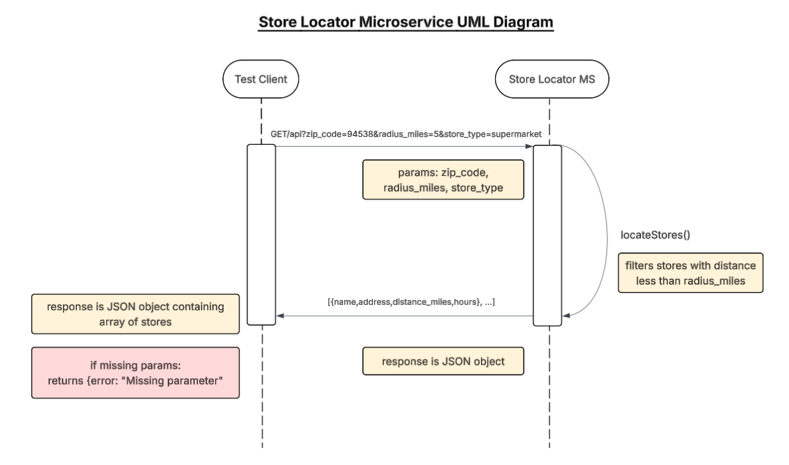

## Unit Converter Microservice

### Description
Microservice returns a list of nearby grocery stores based on US zip code, a search radius and type of store (ex. supermarket) via REST API


### How to request data
Send an HTTP Get request to api with the required query parameters: zip_code, radius_miles, store_type

Javascript Example:

```
//Example Req for searching supermarkets within 5 miles of zipcode 94538

const response = await fetch('https://localhost:3002/api?zip_code=94538&radius_miles=5&store_type=supermarket');
const data = await response.json();

```

### How to receive data
Returns a JSON object containing an array of stores. Each store contains name, address, distance_miles and hours

Example Response in Javascript: 
```
Example Res for searching supermarkets within 5 miles of zipcode 94538

[
    {
        "name": "Safeway",
        "address": "3333 Mowry Ave, Fremont, CA",
        "distance_miles": 1.2,
        "hours": "5:00 AM - 11:00 PM"
    },
    {
        "name": "Trader Joe's",
        "address": "39324 Argonaut Way, Fremont, CA",
        "distance_miles": 1.5,
        "hours": "8:00 AM - 9:00 PM"
    }
]
```

### UML Sequence Diagram



